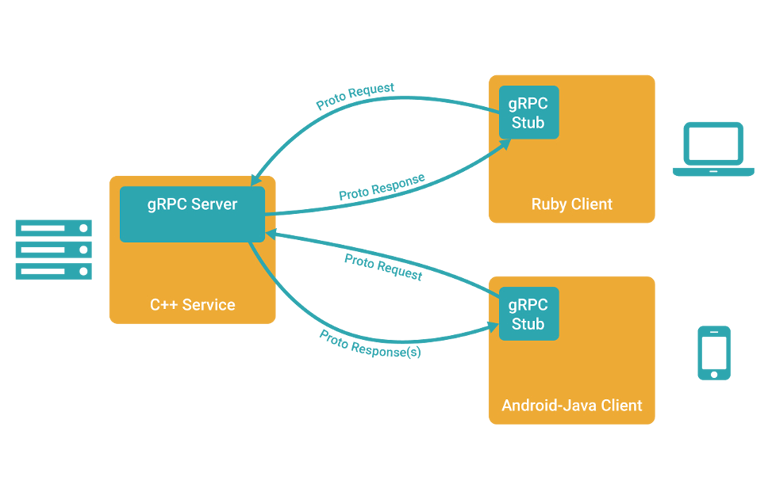

# grpc学习

> **什么是grpc**
> grpc是一个基于http/2协议设计的rpc框架，采用protobuf作为idl。
>
> **什么是protobuf**
> protobuf是一种高效的数据存储格式，由google开发，用于序列化结构化数据，兼容java、python、c++等

## grpc相关介绍

**什么是rpc**

rpc即remote procedure call，远程过程调用。

包含了传输协议和编码（对象序列号）协议等。允许运行于一台计算机的程序调用另一台计算机的子程序，开发人员无需额外为这个交互作用变成。

**实际场景**

两台服务器A和B，在A上的应用C想要调用B服务器上的应用D。通过rpc进行调用。

常见的rpc框架有grpc、thrift、rpcx和dubbo

**为什么要用rpc**

简单、通用、安全、效率

**rpc可以基于http吗**

可以

## protobuf

protocol buffers是一种语言、平台无关，可拓展的序列结构化数据的方法，常用于通信协议，数据存储等。

**语法**

```protobuf
syntax = "proto3";  // 使用proto3语法

service SearchService {
    rpc Search (SearchRequest) returns (SearchResponse) {}
}

message SearchRequest {
    string query = 1;
    int32 page_number = 2;
    int32 result_per_page = 3;
}

message SearchResponse {
    repeated Result results = 1;
}
```

protobuf编译器会根据选择的语言不同，生成相应语言的service interface code和stubs。

**protobuf和xml对比**

- 更简单
- 数据描述文件更小
- 解析速度更快
- 减少了二义性
- 生成的数据访问类更容易使用

## grpc概览

**特点**
- HTTP/2
- Protobuf
- 客户端、服务端基于同一份IDL
- 移动网络的良好支持
- 支持多语言

**概览**


- 客户端grpc sub调用A方法，发起RPC调用
- 对请求信息使用protobuf，进行对象序列化压缩
- 服务端接收到请求后，解码请求体，处理业务逻辑并返回
- 对响应结果使用protobuf进行序列化对象压缩
- 客户端收到服务器响应，解码请求体，回调A方法，唤醒等待响应的客户端调用，并返回响应结果

https://eddycjy.gitbook.io/golang/di-4-ke-grpc/stream-client-server