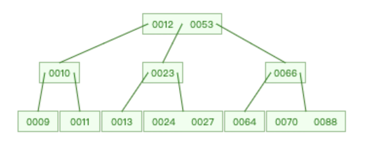

# MySQL

## 0. 什么是MySQL？

开源关系型数据库管理系统，属于Oracle旗下。

### 1. 什么是内连接、外连接、交叉连接、笛卡尔积？

- 内连接：取得两张表中满足存在连接匹配关系的记录。
- 外连接：不只取得两张表中满足存在连接匹配关系的记录，还包括某张表（或两张表）中不满足匹配关系的记录。
- 交叉连接：显示两张表的所有记录一一对应，没有匹配关系筛选。它是笛卡尔积在 SQL 中的实现，如果 A 表有 m 行，B 表有 n 行，那么 A 和 B 交叉连接的结果就有 m*n 行。
- 笛卡尔积：是数学中的一个概念，例如集合 A={a,b}，集合 B={0,1,2}，那么 A✖️B={<a,0>,<a,1>,<a,2>,<b,0>,<b,1>,<b,2>,}。

### 2. MySQL 的内连接、左连接、右连接有什么区别？

MySQL的连接可以分为内连接和外连接，外连接又可以分为左连接和右连接。

- inner join：内连接，在两张表进行连接查询时，只保留两张表中完全匹配的结果集。
  只有当两个表中都有匹配的记录时，这些记录才会出现在查询结果中。如果某一方没有匹配的记录，则该记录不会出现在结果集中。

- left join：返回左表的所有记录，以及右表的匹配记录。如果右表中没有匹配的记录，则结果中右表的部分会以 NULL 填充。

- right join：返回右表的所有记录，以及左表的匹配记录。如果左表中没有匹配的记录，则结果中左表的部分会以 NULL 填充。
  
  ```sql
  -- 返回了至少有一条评论的文章标题和评论内容的前 20 个字符，限制结果为前 2 条记录
  SELECT LEFT(a.TITLE, 20) AS ArticleTitle, LEFT(c.content, 20) AS ComentContent
  FROM article a
  INNER JOIN comment c ON a.ID = c.articleID
  LIMIT 2;
  ```

```sql
-- 返回了所有文字的标题和评论内容的前 20 个字符，即使某些文章没有评论，限制结果为前 2 条记录
SELECT LEFT(a.TITLE, 20) AS ArticleTitle, LEFT(c.content, 20) AS ComentContent
FROM article a
LEFT JOIN comment c ON a.ID = c.articleID
LIMIT 2;
```

```sql
SELECT LEFT(a.TITLE, 20) AS ArticleTitle, LEFT(c.content, 20) AS ComentContent
FROM comment c
RIGHT JOIN article a ON a.ID = c.articleID
LIMIT 2;
```

### 3. 数据库的三大范式

- 第一范式：数据库表中的每一列（每个字段都不可再分），保持原子性；
- 第二范式：在第一范式的基础上，非主键列完全依赖于主键。比如，订单列表里，存储了商品信息（商品价格、商品类型），那就需要把商品 ID 和订单 ID 作为联合主键，才满足第二范式。
- 第三范式：在第二范式的基础上，非主键列只依赖于主键，不依赖于其他非主键列。
- 三大范式的作用是为了控制数据库的冗余，是对空间的节省，实际上，一般互联网公司的设计都是反范式的，通过冗余一些数据，避免跨表跨库，利用空间换时间，提高性能。

### 4. varchar和char的区别

- char
  - 定长字符串；
  - 小于固定长度，空格填充；
  - 因为是定长，读取速度比varchar快，空间换时间；
  - 最多能存放255个字符；
- varchar
  - 变长字符串；
  - 存储空间由实际字符长度决定；
  - 读取速度比char慢，时间换空间；
  - 最多能存放65535个字符；

### 5. blob和text的区别

- blob存储二进制数据（按照字节顺序进行排序和比较），text存储字符串（按照字符集进行排序和比较）

- blob 没有字符集，text 有一个字符集，并且根据字符集的校对规则对值进行排序和比较
  
  > 拓展：MYSQL如何对汉字进行排序？
  > 在MySQL中，你可以使用 COLLATE 关键字来指定排序规则。例如，如果你希望按照拼音对汉字进行排序，可以使用 utf8mb4_unicode_ci 或 utf8mb4_general_ci 排序规则：
  > 
  > ```mysql
  > SELECT * FROM your_table ORDER BY your_column COLLATE utf8mb4_unicode_ci;
  > ```
  > 
  > 原理基本上是将汉字转换成拼音或者其他字符序列。

### 6. DATETIME和TIMESTAMP的异同

**相同点**：

1. 两个数据类型存储时间的表现格式一致。均为 YYYY-MM-DD HH:MM:SS
2. 两个数据类型都包含「日期」和「时间」部分。
3. 两个数据类型都可以存储微秒的小数秒（秒后 6 位小数秒）

**区别**：

- 日期范围：DATETIME 的日期范围是 1000-01-01 00:00:00.000000 到 9999-12-31 23:59:59.999999；TIMESTAMP 的时间范围是1970-01-01 00:00:01.000000 UTC 到 ``2038-01-09 03:14:07.999999 UTC（为什么是2038，因为存储空间限制为4字节，即32位，能存储的整数最大为2^31-1，即2147483647秒，导致了对时间范围的限制）
- 存储空间：DATETIME 的存储空间为 8 字节；TIMESTAMP 的存储空间为 4 字节
- 时区相关：DATETIME 存储时间与时区无关；TIMESTAMP 存储时间与时区有关，显示的值也依赖于时区
- 默认值：DATETIME 的默认值为 null；TIMESTAMP 的字段默认不为空(not null)，默认值为当前时间(CURRENT_TIMESTAMP)

### 7. MySQL 中 in 和 exists 的区别

MySQL 中的 in 语句是把**外表和内表作hash连接**，而 exists 语句是对**外表作loop循环**，每次 loop 循环再对内表进行查询。我们可能认为 exists 比 in 语句的效率要高，这种说法其实是不准确的，要区分情景。EXIST是一个子查询谓词，用于检测子查询的返回值是否为空（只用找到一个记录）。

- 如果查询的两个表大小相当，那么用 in 和 exists 差别不大。
- 如果两个表中一个较小，一个是大表，则子查询表大的用 exists，子查询表小的用 in。
- not in 和 not exists：如果查询语句使用了not in，那么内外表都进行全表扫描，没有用到索引；而 not extsts 的子查询依然能用到表上的索引。所以无论那个表大，用 not exists 都比 not in 要快。

**hash连接的原理**：首先对外部查询的表和子查询的结果集进行哈希处理，然后将它们的哈希值进行比较，以确定是否存在匹配的行。通常用于一个表小，一个表大的情况。

### 8. MySQL 里记录货币用什么字段类型比较好

- 不用float或者double：二进制存储，有一定误差
- 用decimal或者numeric：字符串存储，定点数，精度高，但是存储空间大，可以制定精度

## 9. MySQL如何存储emoji😈

可以直接用字符串存储emoji。但是因为mysql的utf8是阉割版的utf8，最多只用三个字节，存储不了表情。
可以用utf8mb4编码。

```sql
alter table blogs modify content text CHARACTER SET utf8mb4 COLLATE utf8mb4_unicode_ci not null;
```

### 10. drop、delete 与 truncate 的区别

| 类型       | 属于  | 回滚   | 删除内容                      | 删除速度         |
| -------- | --- | ---- | ------------------------- | ------------ |
| delete   | DML | 可回滚  | 表结构还在，删除表的全部或者一部分数据行      | 删除速度慢，需要逐行删除 |
| truncate | DDL | 不可回滚 | 表结构还在，删除表中的所有数据           | 删除速度快        |
| drop     | DDL | 不可回滚 | 从数据库中删除表，所有数据行，索引和权限也会被删除 | 删除速度最快       |

因此，在不再需要一张表的时候，用 drop；在想删除部分数据行时候，用 delete；在保留表而删除所有数据的时候用 truncate。

### #11. UNION和UNION ALL的区别

- UNION：对两个结果集进行并集操作，表连接后筛选掉重复的记录行；（自动去重）
- UNION ALL：不去重。
- 从效率上说，UNION ALL 要比 UNION 快很多，如果合并没有刻意要删除重复行，那么就使用 UNION All

### 12. count(1)、count(*) 与 count(列名) 的区别

- count(*)包括了所有的列，相当于行数，在统计结果的时候，不会忽略列值为 NULL
- count(1)包括了忽略所有列，用 1 代表代码行，在统计结果的时候，不会忽略列值为 NULL
- count(列名)只包括列名那一列，在统计结果的时候，会忽略列值为空（这里的空不是只空字符串或者 0，而是表示 null）的计数，即某个字段值为 NULL 时，不统计。

**执行速度**：

- 列名为主键，count(列名)会比 count(1)快（因为有索引）
- 列名不为主键，count(1)会比 count(列名)快
- 如果表多个列并且没有主键，则 count（1） 的执行效率优于 count（*）
- 如果有主键，则 select count（主键）的执行效率是最优的
- 如果表只有一个字段，则 select count（*）最优。

### 13. 一条SQL语句的执行顺序

from->on->join->where->group by->cube | rollup->having->select->distinct->order by->limit

- from：对from子句的左表和右表执行笛卡尔积，产生虚拟表VT1
- on：对虚拟表VT1应用on筛选只有符合join condition的才会被插入到虚拟表VT2中
- join：如果指定了 OUTER JOIN（如 LEFT OUTER JOIN、RIGHT OUTER JOIN），那么保留表中未匹配的行作为外部行添加到虚拟表 VT2 中，产生虚拟表 VT3。如果 FROM 子句包含两个以上表，则对上一个连接生成的结果表 VT3 和下一个表重复执行步骤 1）～步骤 3），直到处理完所有的表为止
- where：对虚拟表 VT3 应用 WHERE 过滤条件，只有符合<where_condition>的记录才被插入虚拟表 VT4 中
- group by：根据group by子句中的列，对虚拟表 VT4 中的记录进行分组操作，产生虚拟表 VT5
- cube | rollup：对虚拟表 VT5 进行分组操作，生成超集，包括分组列、分组列的统计函数，生成VT6
- having：对虚拟表 VT6 应用 HAVING 过滤条件，生成虚拟表VT7
- select：第二次执行 SELECT 操作，选择指定的列，插入到虚拟表 VT8 中
- distinct：去除重复数据，产生虚拟表 VT9
- order by：排序，生成虚拟表 VT10
- limit：取出指定行的记录，产生虚拟表 VT11，并返回结果

### 67. 介绍一下MySQL的常用命令

- 数据库操作命令
  
  - 创建数据库  `CREATE DATABASE database_name;`
  - 删除数据库  `DROP DATABASE database_name;`
  - 选择数据库  `USE database_name;`

- 表操作命令
  
  - 创建表      
    
    ```sql
    CREATE TABLE table_name (
    column1 datatype,
    column2 datatype,
    ...
    );
    ```
  
  - 删除表      `DROP TABLE table_name;`
  
  - 显示所有表  `SHOW TABLES;` 
  
  - 查看表结构  `DESCRIBE table_name;`
  
  - 修改表      `ALTER TABLE table_name ADD colume_name datatype;`

- CRUD命令

- 插入数据

- INSERT INTO table_name (column1, column2, ...) VALUES (value1, value2, ...);

- 查询数据

- SELECT column_names FROM table_name WHERE condition;

- 更新数据

- UPDATE table_name SET column1 = value1, column2 = value2 WHERE condition;

- 删除数据

- DELETE FROM table_name WHERE condition;

- 索引和约束

- 索引  `CREATE INDEX index_name ON table_name (column_name);`

- 添加主键约束  `ALTER TABLE table_name ADD PRIMARY KEY (column_name)`

- 添加外键约束  `ALTER TABLE table_name ADD CONSTRAINT fk_name FOREIGN KEY (column_name) REFERENCES parent_table`

- 用户和权限管理

- 创建用户  `CREATE USER 'username'@'host' IDENTIFIED BY 'password';`

- 授予权限  `GRANT ALL PRIVILEGES ON database_name.table_name TO 'username';`

- 撤销权限  `REVOKE ALL PRIVILEGES ON database_name.table_name FROM 'username';` 

- 删除用户  `DROP USER 'username'@'host'`;

- 事务控制

- 开始事务  START TRANSACTION;

- 提交事务  COMMIT;

- 回滚事务  ROLLBACK；

## 数据库架构

### 14. MySQL的基础架构

MySQL的逻辑架构分为三层：

- 客户端：最上层的服务并不是MySQL独有的，大多数基于网络的客户端/服务器工具或服务都有类似的架构，如连接处理、授权认证、安全等。
- Server层：大多MySQL的核心服务功能都在此层，包括查询解析、分析、优化、缓存和内置函数，跨存储引擎的功能也在这一层实现，如存储过程、触发器、视图等。
- 存储引擎层，负责MySQL中数据的存储和提取，不同存储引擎如InnoDB、MyISAM等有不同的功能和特性。Server层通过API与存储引擎层进行通信，这些接口屏蔽了不同存储引擎之间的差异，使得这些差异对上层的查询过程中透明。

### 15. 一条SQL语句在MySQL中如何执行

- **权限查询**：先检查该语句是否有权限，如果没有权限，直接返回错误信息，如果有权限会先查询缓存 (MySQL8.0 版本以前)。
- **语法分析**：提取sql语句中select等关键元素，盘算是否有语法错误，关键词是否正确等。
- **查询优化**：对查询语句进行优化，确定执行方案。
- **执行结果**：调用数据库引擎接口，返回执行结果。

## 存储引擎

### 16. MySQL有哪些常见的存储引擎

| 功能       | InnoDB | MyISAM | MEMORY |
| -------- | ------ | ------ | ------ |
| 支持事务     | ✅      | ❎      | ❎      |
| 支持全文索引   | ✅      | ✅      | ❎      |
| 支持B+树索引  | ✅      | ✅      | ✅      |
| 支持Hash索引 | ✅      | ❎      | ✅      |
| 支持外键     | ✅      | ❎      | ❎      |

- MySQL5.5之前，默认存储引擎是 MyISAM，5.5 之后是 InnoDB。

- InnoDB 支持的哈希索引是自适应的，不能人为干预。

- InnoDB 从 MySQL 5.6 开始，支持全文索引。

- InnoDB 的最小表空间略小于 10M，最大表空间取决于页面大小（page size）。

### 17. 存储引擎应该如何选择

- 大多数情况，使用默认的InnoDB，InnoDB可以提供事务、行级锁等能力。
- MyISAM 适合读更多的场景。
- MEMORY 适合临时表，数据量不大的情况。由于数据都存放在内存，所以速度非常快。

### 18. InnoDB和MyISAM的主要区别

InnoDB和MyISAM的主要区别表现在：

- 存储结构

- 事务支持

- 最小锁粒度

- 索引类型

- 主键必须

- 表的具体行数

- 外键支持

**存储结构**

- MyISAM使用三种格式的文件来存储，.frm存储文件存储表的定义；.MYD存储数据；.MYI存储索引。（定义、数据、索引分开存储）

- InnoDB使用两种格式的文件来存储，.frm 文件存储表的定义；.ibd 存储数据和索引。（定义、数据和索引）

**事务支持**

**最小锁粒度**

- MyISAM：表级锁，高并发中写操作存在性能瓶颈

- InnoDB：行级锁，并发写入性能高

**索引类型**

- MyISAM：非聚簇索引，索引和数据分开存储，索引保存的是**数据文件的指针**。

- InnoDB ：聚簇索引，索引和数据不分开。

**外键支持**

**主键必须**

**表的具体行数**

MyISAM 表的具体行数存储在表的属性中，查询时直接返回；InnoDB 表的具体行数需要扫描整个表才能返回。

## SQL优化
### 24. 慢SQL如何定位
**什么是慢SQL**：执行时间较长的SQL。MySQL 中 long_query_time 默认值是 10 秒，也就是执行时间超过 10 秒的 SQL 语句会被记录到慢查询日志中。

`show variables like 'long_query_time';`查看当前的long_query_time值。

> MySQL执行过程：
> - 客户端发送SQL语句到MySQL服务器
> - 如果查询缓存打开则会优先查询缓存，如果缓存中有对应的结果，直接返回给客户端。（目前已移除查询缓存）
> - 语法分析：分析器对 SQL 语句进行语法分析，判断是否有语法错误。
> - 通过**优化器**生成执行计划
> - 调用存储引擎接口，执行SQL语句。

SQL 执行过程中，优化器通过**成本计算**预估出执行效率最高的方式，基本的预估维度为：
- IO成本：从磁盘读取数据到内存的开销。
  - 数据量：数据量越大，IO 成本越高。所以要避免 select *；尽量分页查询。
  - 数据从哪读取：尽量通过索引加快查询。
- CPU成本：CPU 处理内存中数据的开销。
  - 尽量避免复杂的查询条件，如有必要，考虑对子查询结果进行过滤。
  - 尽量缩减计算成本，比如说为排序字段加上索引，提高排序效率；比如说使用 union all 替代 union，减少去重处理。

**如何定位慢SQL**
- 开启慢查询日志，利用工具如mysqldumpslow对慢查询日志进行分析；
- 服务监控，在业务基建中，加入对慢SQL的监控，常见方案有字节码插桩、连接池扩展、ORM框架对服务运行中的慢SQL进行监控和告警。

### 25. 慢SQL的优化方法

### 26. 如何查看执行计划explain，如何理解各个字段的含义

explain 是 sql 优化的利器，除了优化慢 sql，平时的 sql 编写，也应该先 explain，查看一下执行计划，看看是否还有优化的空间。

**直接在 select 语句之前增加explain 关键字**，就会返回执行计划的信息。


## 索引

> 面试中的重中之重。

### 27. 索引分类

从功能、数据结构、存储位置三个维度对索引进行分类。
**功能维度**

- 主键索引: 表中每行数据唯一标识的索引，强调列值的唯一性和非空性。
  当创建表的时候，可以直接指定主键索引。
  其中id列被指定为主键索引，MySQL会直接为该列创建一个聚簇索引（主键索引一定是聚簇索引。）
  
  ```sql
  CREATE TABLE users (
    id INT AUTO_INCREMENT PRIMARY KEY,
    username VARCHAR(255) NOT NULL,
    email VARCHAR(255),
  );
  ```

`show index from table_name`查看索引信息。

- 唯一索引：保证数据列中每行数据的唯一性，允许有空值。
  
  ```sql
  CREATE UNIQUE INDEX idx_username ON users(username);
  ```

- 普通索引：基本的索引类型，用于加速查询。
  
  ```sql
  CREATE INDEX idx_email ON users(email);
  ```

- 全文索引：特定于文本数据的索引，用于提高文本搜索的效率。
  
  ```sql
  CREATE FULLTEXT INDEX idx_article_content ON articles(content);
  ```

**数据结构**

- B+树索引

- Hash索引
  
  ```sql
  SHOW VARIABLES LIKE 'innodb_adaptive_hash_index';
  ```

### 28. 为什么使用索引会加快查询

**索引大大减少了扫描次数。**

数据库文件是存储在磁盘上的，磁盘IO是数据库操作中最耗时的部分之一。没有索引时，数据库会进行全表扫描（O(n)），表的数据量非常大时，会导致大量的IO操作。

有了索引，就可以直接跳到索引指示的数据位置，而不用扫描整张表。

索引文件相较于数据库文件，体积小得多，查到索引之后再映射到数据库记录，查询效率就会高很多。

### 29. 创建索引有哪些注意点

1. 选择合适的列作为索引
   - 经常作为查询条件（where，order by，group by）
   - 不要建索引：
     - 区分度低的字段
     - 频繁更新的字段
     - 无序值，如UUID，当主键具有不确定性时，会造成叶子结点频繁分裂，造成存储的碎片化。
2. 避免过多的索引
   - 每个索引都需要占用额外的磁盘空间。
   - 更新表（INSERT、UPDATE、DELETE 操作）时，所有的索引都需要被更新。
   - 维护索引文件需要成本；还会导致页分裂，IO 次数增多
3. 利用前缀索引和索引列的顺序
   - 字符串类型的列，前缀索引减小索引大小
   - 创建复合索引时，根据查询条件将最常用作过滤条件的列放在最前面。

### 30. 索引失效的场景

- 在索引列上使用函数表达式
- 使用不等于<>或者NOT操作符，导致全表扫描
- 使用 LIKE 操作符，但是通配符在最前面：如果 LIKE 的模式串是以“%”或者“_”开头的，那么索引也无法使用。例如：SELECT * FROM table WHERE column LIKE '%abc'。
- OR 操作符：如果查询条件中使用了 OR，并且 OR 两边的条件分别涉及不同的索引，那么这些索引可能都无法使用。
- 如果 MySQL 估计使用全表扫描比使用索引更快时（通常是小表或者大部分行都满足 WHERE 子句），也不会使用索引。
- 联合索引不满足最左前缀原则时，索引会失效。

### 31. 索引不适合哪些场景

- 数据表较小
- 频繁更新的列

### 32. 索引是不是建的越多越好

从下面几个角度：

- 存储空间：索引会占据磁盘空间
- 频繁更新：索引虽然会提高查询效率，但是会降低更新表的效率。比如每次对表进行增删改操作，MySQL 不仅要保存数据，还有保存或者更新对应的索引文件。

### 33. 为什么InnoDB使用B+树作为索引

**B树**
B树是一种**自平衡多路查找树**，与红黑树、二叉平衡树不同，B树的每个节点都可以有m个子节点，而红黑树和二叉平衡树都只有两个。

> 红黑树、二叉平衡树都是细高个，B树是矮胖子。 



内存和磁盘在进行IO读写时，有一个最小逻辑单元，叫做页，一般是4KB。
为了提高读写效率，从磁盘往内存中读数据的时候，一次会**读取至少一页的数据**，比如说读取 2KB 的数据，实际上会读取 4KB 的数据；读取 5KB 的数据，实际上会读取 8KB 的数据。我们要**尽量减少读写的次数**。

红黑树、二叉平衡树这类较高的树，查找数据需要更多的磁盘IO，每一层都可能需要从磁盘中加载新的节点。

B树的节点通常与页的大小对齐，这样每次从磁盘加载一个节点时，可以正好是一个页的大小。因为B树的节点可以有很多子节点，所以可以填充更多的信息以达到一页的大小。

B树的一个节点通常包括三个部分：
- 键值：key，即表中的主键
- 指针：存储子节点的信息
- 数据：表中记录除了主键外的数据

因为B树每个节点都存储了数据，导致每个节点能存储的键值和指针变少了（因为页的大小是固定的）。B+树的出现为了改善B树存在的这个问题。

**B+树**
B+树是B树的变种，B+树的非叶子结点只存储键值，不存储数据。
叶子节点存储了所有的数据，并且构成了一个有序链表。

由于非叶子结点没有存储数据，就可以存储更多的键值对，树就可以更加矮胖。
因此，查找数据进行的磁盘IO就更少了，查询效率也更高了。
叶子结点构成了一个有序链表，范围查找时key直接通过叶子结点的指针顺序访问整个查询范围内的所有记录，无需对树进行多次遍历。

InnoDB选择B+树的原因：
- 更高效的磁盘IO，减少了磁盘寻道时间和页的加载次数；
- 支持范围查询；
- 查询性能稳定，B+树的所有查找操作都要查到叶子节点，这使得所有的查询操作都有着相同的访问深度，因此查询性能非常稳定。不像某些其他数据结构，如 B 树，其查询性能因为数据存在所有的节点上导致深度不一致，性能不稳定。

在InnoDB存储引擎中，默认的页大小是16KB，可以通过`show variables like 'innodb_page_size';`查看。

总结：
MySQL 的默认存储引擎是 InnoDB，它采用的是 B+树索引，B+树是一种自平衡的多路查找树，和红黑树、二叉平衡树不同，B+树的每个节点可以有 m 个子节点，而红黑树和二叉平衡树都只有 2 个。

和 B 树不同，B+树的非叶子节点只存储键值，不存储数据，而叶子节点存储了所有的数据，并且构成了一个有序链表。

这样做的好处是，非叶子节点上由于没有存储数据，就可以存储更多的键值对，再加上叶子节点构成了一个有序链表，范围查询时就可以直接通过叶子节点间的指针顺序访问整个查询范围内的所有记录，而无需对树进行多次遍历。查询的效率会更高。

### 34. 一颗B+树能够存储多少条数据
B+树只有叶子结点存放key值，所有节点都在同一高度。

假设主键ID是bigint类型，长度为8字节，指针大小在InnoDB源码中设置6字节，即一共14字节。非叶子结点（一页）可以存储16384/14=1180这样的单元（键值+指针）。

一个指针指向一个存放记录的页，一页可以放16条数据（默认数据页为16K，一条数据1K）。树深度为2时，可以存放1170*16=18720条记录。

树深度为3时，可以存储的数据为1170 * 1170 * 16=21902400条记录。

InnoDB存储引擎中，B+树的高度一般为2-4层，可以满足千万级数据的存储，查找数据的时候，一次页的查找代表一次 IO，当我们通过主键索引查询的时候，最多只需要 2-4 次 IO 就可以了。

**innodb 使用数据页存储数据？默认数据页大小 16K，我现在有一张表，有 2kw 数据，我这个 b+树的高度有几层？**


### 35. B+树和普通二叉树 
**查询效率**：普通二叉树存在退化情况，如果退化成链表，相当于全表扫描。平衡二叉树相比于二叉查找树来说，查找效率更稳定，总体的查找速度也更快。

**为什么不用平衡二叉树**
读取数据的时候，是**从磁盘读到内存**。如果树这种数据结构作为索引，那每查找一次数据就需要从磁盘中读取一个节点，也就是一个磁盘块，但是平衡二叉树可是每个节点只存储一个键值和数据的，如果是** B+ 树，可以存储更多的节点数据**，树的高度也会降低，因此读取磁盘的次数就降下来了，查询效率就快。

### 36. B+树和B树
**查询效率**：
B树所有值都存在叶子结点，叶子结点之间通过指针连接，形成一个有序链表。B+树非常适合进行范围查询，例如SQL中的ORDER BY和BETWEEN查询。

而B树的数据分布在整个树中，进行范围查询时可能要遍历树的多个层级。

**更高的空间利用率**
B+树非叶子结点可以拥有更多的键，从而有更多的分叉。导致树的高度更低，进一步降低了查询时磁盘IO的次数。

**查询效率更稳定**
B+树中**所有叶子节点深度相同**，**所有数据查询路径长度相等**，保证了每次搜索的性能稳定性。而在 B 树中，数据可以存储在内部节点，不同的查询可能需要不同深度的搜索。

### 37. Hash索引和B+树索引
**B+树支持而Hash不支持的**
- 范围查询
- 联合索引的最左侧原则
- order by查询
- B+ 树使用 like 进行模糊查询的时候，LIKE 'abc%' 的话可以起到索引优化的作用，Hash 索引无法进行模糊查询。

Hash索引在等值查询上比B+树索引效率更高。

**MySQL模糊查询**
使用LIKE语句，结合通配符%和_来实现。
如果%出现在搜索字符串的开始位置，MySQL将无法使用索引，必须全表扫描。

### 38. 聚簇索引和非聚簇索引
聚簇索引不是一种新的索引，而是一种**数据存储方式**。

在聚簇索引中，表中的行是按照键值的顺序存储的，表中的实际数据行和键值之间存在物理排序的关系。每个表只有一个聚簇索引。在 MySQL 的 InnoDB 存储引擎中，主键就是聚簇索引。

在非聚簇索引中，索引和数据是分开存储的，索引中的键值指向数据的实际存储位置。因此，非聚簇索引也被称为二级索引或辅助索引。表可以有多个非聚簇索引。

当使用非聚簇索引检索数据时，数据库首先在索引中查找，然后通过索引中的指针去访问表中实际的数据行，这个过程称为“回表”（Bookmark Lookup）。

举例来说：
- InnoDB 采用的是聚簇索引，如果没有显式定义主键，InnoDB 会选择一个唯一的非空列作为隐式的聚簇索引；如果这样的列也不存在，InnoDB 会自动生成一个隐藏的行 ID 作为聚簇索引。这意味着数据与主键是紧密绑定的，行数据直接存储在索引的叶子节点上。
- MyISAM 采用的是非聚簇索引，表数据存储在一个地方，而索引存储在另一个地方，索引指向数据行的物理位置。

### 39. 回表
**使用非聚簇索引查找数据时，数据库会进行两步操作**
- 查找索引：查找非局促索引，找到索引键值对应的数据项，包括数据行在磁盘上的位置信息。
- 读取数据：根据位置信息，在磁盘上读取响应的数据行。

即：先查找索引，再根据索引回到数据表中查找实际数据。

使用非聚簇索引查找数据通常比使用聚簇索引要慢，因为**需要进行两次磁盘访问**。当然，如果索引所在的数据页已经被加载到内存中，那么非聚簇索引的查找速度也可以非常快。

### 40. 覆盖索引
在辅助索引中，不管是单列索引还是联合索引，如果select的数据列只用辅助索引就能够获得，不需要查主键索引，这是使用的索引就叫做覆盖索引，避免了回表。

- 主键索引：存储索引和数据；
- 辅助索引：存储索引和主键。

### 41. 最左前缀原则
最左前缀原则，也叫**最左匹配原则**，或者最左前缀匹配原则。

最左匹配原则是指在使用联合索引（即包含多列的索引）时，**查询条件从索引的最左列开始并且不跳过中间的列**。

如果一个复合索引包含(col1, col2, col3)，那么它可以支持 col1、col1,col2 和 col1, col2, col3 的查询优化，但不会优化只有 col2 或 col3 的查询。

也就说，在进行查询时，**如果没有遵循最左前缀，那么索引可能不会被利用，导致查询效率降低。**

**为什么不从最左开始查，就无法匹配？**

联合索引在B+树中是复合数据结构，按照从左到右的顺序以此建立搜索树，其中左边是有序的右边是无序的。在左边相等时，才会比较右边。（左边相等时右边有序的前置条件）

### 42. 索引下推优化
**索引下推在非主键索引上的优化，对索引中包含的字段先做判断，直接过滤掉不满足条件的记录，可以有效减少回表的次数，大大提升了查询的效率。**

索引条件下推优化（Index Condition Pushdown，ICP）是MySQL5.6添加的，用于优化数据查询。
- 不适用索引条件下推优化时，存储引擎通过索引检索到数据，返回给MySQL Server，MySQL Server进行过滤条件的判断。
- 使用索引条件下推优化时，如果**存在某些被索引的列的判断条件时**，MySQL Server **将这一部分判断条件下推给存储引擎**，然后由存储引擎通过判断索引是否符合 MySQL Server 传递的条件，只有当索引符合条件时才会将数据检索出来返回给 MySQL 服务器。

使用索引下推优化，将where条件放在引擎层执行，直接进行条件过滤。

## 锁
### 43. MySQL中有哪几种锁，列举一下？
按照锁粒度划分，有以下三种
- 表锁：开销小，加锁快；锁定力度大，发生锁冲突概率高，并发度最低;不会出现死锁。
- 行锁：开销大，加锁慢；会出现死锁；锁定粒度小，发生锁冲突的概率低，并发度高。
- 页锁：开销和加锁速度介于表锁和行锁之间；会出现死锁；锁定粒度介于表锁和行锁之间，并发度一般

### 44. 说说InnoDB的行锁实现
InnoDB行锁是通过**给索引上的索引项加锁**来实现的，而不是对记录加锁。
- Record Lock 记录锁
  记录锁就是直接锁定某行记录，当我们使用唯一性的索引（包括唯一索引和聚簇索引）进行等值查询且精确匹配到一条记录时，会直接将这条记录锁定。
- Gap Lock 间隙锁
  间隙锁指两个记录之间逻辑上尚未填入数据的部分，是一个**左开右开**的区间。
  间隙锁是缩影某些间隙区间的，当我们使用**等值查询**或者**范围查询**，并且没有命中任何一个record，此时就会对间隙区间锁定。
- Next-Key Lock 临键锁
  临键锁指的是间隙加上它右边的记录组成的左开右闭区间。比如上述的(1,6]、(6,8]等。
  临键锁锁住的区间包括record右边的临键区间。mysql默认的行锁类型是临键锁，当使用唯一索引，等值匹配查询到一条记录时，临键锁会退化成记录锁，没有匹配到任何记录时，退化成间隙锁。

> 间隙锁(Gap Locks)和临键锁(Next-Key Locks)都是用来解决幻读问题的，在已提交读（READ COMMITTED）隔离级别下，间隙锁(Gap Locks)和临键锁(Next-Key Locks)都会失效！
  
- Inser Intention Lock 插入意向锁
  一个事务在插入一条记录时，需要判断插入位置是否被别的事务加了意向锁。如果有，插入操作需要等待，直到拥有意向锁的那个事务提交。
  事务在等待时也需要在内存中生成一个锁结构，表明有事务想要在某个间隙中插入新纪录，但是现在在等待。这种锁命名为Insert Intention Locks也就是插入意向锁。
  
  **两两插入意向锁之间不会排斥**

### 45. 意向锁是什么
意向锁是一个表级锁，意向锁和插入意向锁不同。

意向锁的出现是为了支持InnoDB的多粒度锁，解决表锁和行锁共存的问题。
当我们需要给一张表加表锁时，需要判断该表中有没有数据行被锁定，以确定是否能加锁成功。

如果没有意向锁，需要遍历表中的数据行判断有没有行锁。

有了意向锁这个表级锁后，直接判断一次就知道表中是否有数据行被锁定。

有了意向锁之后，要执行的事务A在申请行锁前，数据库会自动给事务A申请表的意向排他锁。当事务B申请表的互斥锁时就会失败。

### 46. MySQL 的乐观锁和悲观锁
**悲观锁**
悲观锁认为被他保护的数据是极不安全的，一个事务拿到悲观锁后，其他任何事务都不能对该数据进行修改，只能等待锁被释放才可以执行。

数据库中的行锁、表锁、读锁、写锁都是悲观锁。

**乐观锁**
乐观锁认为数据的变动不会太频繁。

乐观锁通常是在表中增加一个version或时间戳timestamp实现。其中，版本为最常见。

事务在数据库中取数据时，会同时取出版本。当事务对数据变动完毕想要将其更新在表中时，会将之前取出的版本v1与最新版本v2相比，如果相等，则没有其他事物进行修改。此时允许对表中的数据进行修改，并且修改时version+1，表明已变动。

如果v1不等于v2，则说明有变动，一般处理办法是通知用户重新操作。乐观锁一般由开发者实现。

### 47. MySQL遇到过死锁问题吗，如何解决的
死锁排查步骤
- 查看死锁日志 show engine innodb status;
- 分析死锁日志，找到死锁的SQL语句
- 分析SQL加锁情况
- 模拟死锁案发
- 分析死锁日志
- 分析死锁结果

### 48. 死锁的产生原因
- 两个事务分别占有一个锁，并且互相等待对方释放锁。
- 两个事务分别占有一个锁，并且互相等待对方释放锁。

### 49. 死锁的解决方法
- 死锁检测：数据库会自动检测死锁，并自动回滚其中一个事务，释放锁。

## 事务
### 48. MySQL事务的四大特性
**事务**：事务是一个或多个SQL语句组成的一个执行单元，这些SQL语句要么全部执行成功，要么全部不执行，不会出现部分执行的情况。
事务是数据库管理系统执行过程的一个逻辑单位，由一个有限的数据操作序列构成。

事务的主要作用是保证数据库操作的一致性，即事务内的操作，要么全部成功，要么全部失败回归，不会出现中间状态。

**事务的ACID特性**
- Atomic原子性：原子性子性意味着事务中的所有操作要么全部完成，要么全部不完成，它是不可分割的单位。如果事务中的任何一个操作失败了，整个事务都会回滚到事务开始之前的状态，如同这些操作从未被执行过一样。
- Consistency一致性：一致性确保事务从一个一致的状态转换到另一个一致的状态。
- Isolation隔离性：并发执行的事务是彼此隔离的，一个事务的执行不会被其他事务干扰。隔离性主要为了解决事务并发执行中可能出现的问题，如脏读、不可重复读、幻读等。
数据库系统通过事务隔离级别（如读未提交、读已提交、可重复读、串行化）来实现事务的隔离性。
  - Read Uncommitted 读未提交
    事务A可以读取到事务B未提交的数据。
  - Read Committed 读已提交
    事务A只能读取到事务B已提交的数据。
  - Repeatable Read 可重复读
    事务A可以读取到事务B已提交的数据，但是事务A在同一个事务中多次读取到的数据是相同的。
  - Serializable 串行化
- Durability持久性
  持久性确保事务一旦提交，它对数据库所做的更改就是永久性的，即使发生系统崩溃，数据库也能恢复到最近一次提交的状态。通常，持久性是通过数据库的恢复和日志机制来实现的，确保提交的事务更改不会丢失。

### 49. ACID靠什么实现的
MySQL通过事务管理和持久性存储确保ACID。
- 原子性：MySQL通过undo log实现（正确提交 清除/操作失败 回滚）
- 一致性：通过原子性、隔离性、持久性保证。
- 隔离性：MySQL通过MVCC多版本并发控制机制处理。确保每个事务都有自己的数据版本。
  - 在 MVCC 中，每次更新记录时，都会生成记录的一个新版本，而不是覆盖老版本。每个版本都会有两个额外的属性：一个表示版本的创建时间（或事务 ID），另一个表示版本的过期时间（或下一个版本的事务 ID）。
  - 当事务尝试读取记录时，它会看到该事务开始时有效的那个版本。
  - MVCC 通过提供数据版本来支持事务的隔离性。不同的事务会看到不同版本的数据行，这取决于事务的开始时间和它的隔离级别。
  - 对于如 "读未提交"（READ UNCOMMITTED）这样的较低隔离级别，事务可能会看到其他未提交事务所做的更改。但在更高的隔离级别，如 "可重复读"（REPEATABLE READ）或 "串行化"（SERIALIZABLE），事务不会看到其他事务所做的更改，直到它们被提交。
- 持久性：MySQL通过redo log实现。（redo log是一种物理日志，记录了对数据页的物理更改。当事务进行写操作时，innodb首先会写入redo log，并不会立即修改数据文件，这种写入方式被称为write ahead log先写日志，当redo被填满或者其他情况下，innodb辉异步刷盘）
  系统崩溃时，由于数据可能还没有被真正写入数据文件，但已经在 redo log 中，因此系统可以在启动时使用这些日志来重新执行或“重做”这些更改，确保数据的持久性。

  即使数据库在事务提交后立即崩溃，由于事务的更改已经记录在 redo log 中，这些更改在数据库恢复时仍然是安全的。

### 50. 事务的隔离级别有哪些，MySQL默认的隔离级别是什么？
事务的隔离级别决定了一个事务可能受其他事务影响的程度，MySQL支持的四种隔离级别分别是：
- 读未提交：最低的隔离级别，事务可以读取未被其他事务提交的数据，以至于会出现脏读、不可重复读和幻读的问题。
- 读已提交：事务只能读取已经被其他事务提交的数据，可以避免“脏读”现象。但不可重复读和幻读问题仍然存在。
- 可重复读：确保同一事务多次读取相同记录的结果是一致的，即使其他事务对这条记录进行了修改，也不会影响到当前事务。是MySQL默认的隔离级别，避免了脏读和不可重复读，很大程度上解决了幻读问题。
  > 什么是幻读？
  > 幻读是指在一个事务中执行两次相同的查询，第二次查询返回的行数可能比第一次查询返回的行数多。幻读只存在于多事务同时对同一数据表进行操作的情况下。
- 串行化：最高的隔离级别，通过强制事务串行执行来避免并发问题，可以解决“脏读”、“不可重复读”和“幻读”问题。但会导致大量的超时和锁竞争问题。

### 51. 什么是幻读、脏读、不可重复读呢？
- 脏读：事务A和B交替执行，事务A读取到事务B未提交的数据，即脏读；
- 不可重复读：在一个事务范围内，两次相同的查询，读取同一条记录，却返回了不同数据。
- 幻读：事务 A 查询一个范围的结果集，另一个并发事务 B 往这个范围中插入 / 删除了数据，并静悄悄地提交，然后事务 A 再次查询相同的范围，两次读取得到的结果集不一样了，这就是幻读。

**不可重复读和幻读**：一个是返回不同的数据，一个是返回不同的结果集。

### 52. 事务的各个隔离级别都是如何实现的
**读未提交**
读未提交，采用的是读不加锁原理。
- 事务读不加锁，不阻塞其他事务的读和写；
- 事务写不阻塞其他事务写，但不阻塞其他事务读；

**读已提交&可重复读**
读取已提交和可重复读级别采用了ReadView和MVCC，也就是每个事务只能读取到他能看到的版本。
- READ COMMITTED：每次读取数据前都生成一个 ReadView；
- REPEATABLE READ：在第一次读取数据时生成一个 ReadView

**串行化**
串行化的实现采用的是读写都加锁的原理。
串行化的情况下，对于同一行事务，**写会加写锁，读会加读锁**。当出现读写锁冲突的时候，后访问的事务必须等前一个事务执行完成，才能继续执行。

### 53. MVCC了解吗，怎么实现的
MVCC（Multi-Version Concurrency Control）多版本并发控制，简单来说是通过维护数据历史版本，从而解决并发访问情况下的**读一致性问题**。
MVCC的实现需要抓住几个关键点：
- 隐式字段
- undo日志
- 版本链：对于Innodb存储引擎，每一行记录都有两个隐藏列
  - DB_TRX_ID：事务ID，每次修改时，会将该事务ID复制给DB_TRX_ID。
  - DB_ROLL_PTR：回滚指针，每次修改时，会将前一次的DB_ROLL_PTR复制给DB_ROLL_PTR，指向回滚段的undo日志。
- 快照读&当前读
- Read View
  > 对于Read Committed（读已提交）和Repeatable Read（可重复读）隔离级别来说，都需要读取已经提交的事务所修改的记录，也就是说如果版本链中某个版本的修改没有提交，那么该版本的记录时不能被读取的。所以需要确定在Read Committed和Repeatable Read隔离级别下，版本链中哪个版本是能被当前事务读取的。于是就引入了ReadView这个概念来解决这个问题。
  
  Read View 就是事务执行快照读时，产生的读视图，相当于某时刻表记录的一个快照，通过这个快照，我们可以获取：


是 MySQL 数据库的并发控制的一种方式。MVCC 允许在数据库中同时进行多个并发事务，并且它们之间不会相互影响，可以实现真正的并发控制。

### 54. 

### 55. 

### 56. 

### 57. 

### 58.
## 高可用/性能

## 运维