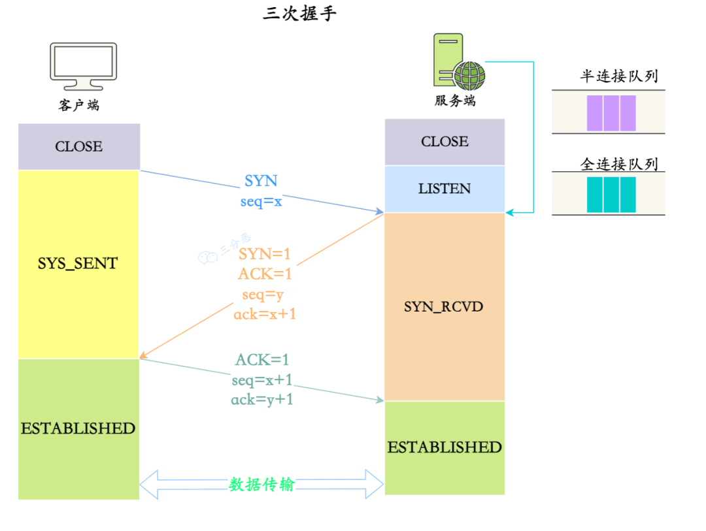
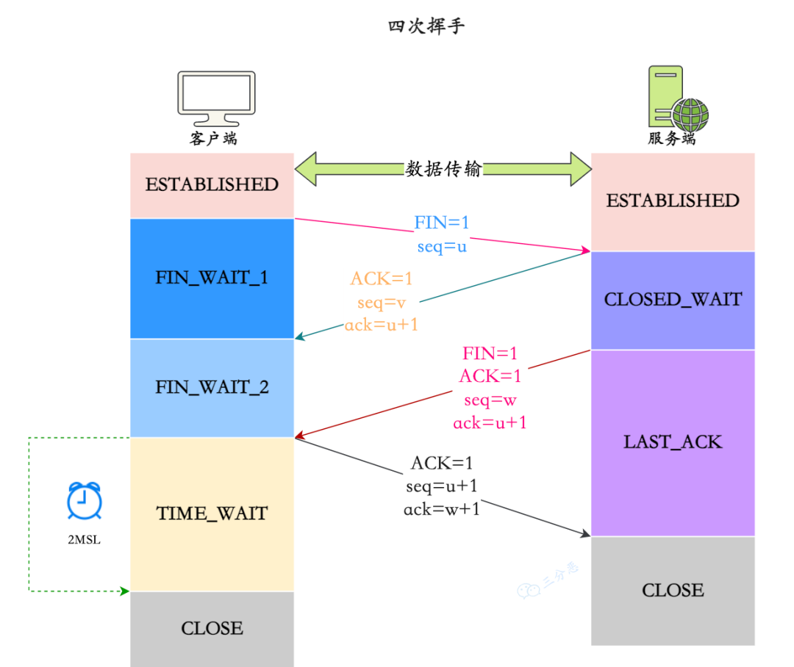
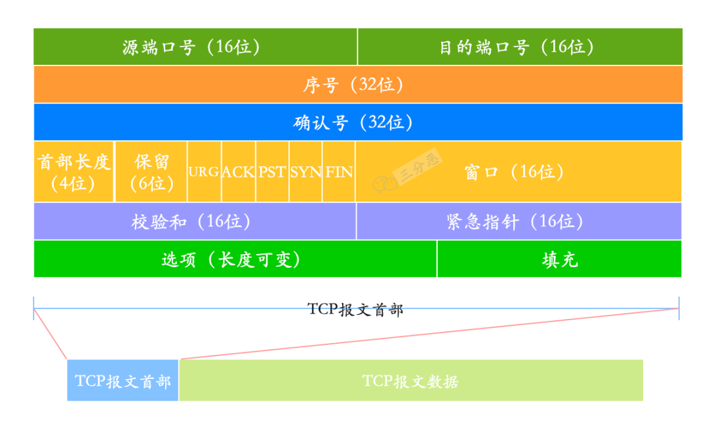

# 计算机网络八股文

## 基础
### 1. 计算机网络体系结构
计算机网络体系结构通过将复杂的网络通信分解为不同层次，来标注化交互的过程。
常见的模型包括OSI七层模型，TCP/IP四层模型和五层体系结构。
- OSI七层模型，自底向上分别为：
  - 物理层
  - 数据链路层
  - 网络层
  - 传输层
  - 会话层
  - 表示层
  - 应用层
- TCP/IP四层模型，自底向上分别为：
  - 网络接口层（物理层，数据链路层）
  - 网际层（网络层）
  - 传输层
  - 应用层（会话层、表示层、应用层）
- 五层结构
  - 物理层
  - 数据链路层
  - 网络层
  - 传输层
  - 应用层

其中，OSI为理论上的网络通信模型，TCP/IP是实际应用层面的网络通信模型，五层结构方便理解和记忆。

**OSI七层模型**
自顶向下进行描述：
- 应用层：最靠近用户的层，负责处理特定的应用程序细节。提供了网络服务与应用软件之间的接口。
  如Web浏览器、FTP客户端和服务器、电子邮件客户端等。
- 表示层：确保一个系统发送的信息可以被另一个系统的应用层读取。负责数据的转换、压缩和加密。
  如确保数据从一个编码格式转换为另一种，如ASCII到EBCDIC。
- 会话层：管理用户会话，控制网络上两节点的对话和数据交换的原理，负责建立、维护和终止会话。
- 传输层：负责端到端的通信服务，确保数据的完整性和正确顺序。包括TCP、UDP等协议。
- 数据链路层：在物理连接中提供可靠的传输，负责简历和维护相邻节点的链路，包括帧同步、MAC（媒体访问控制协议）。
- 物理层：负责在物理没接上提供可靠的传输，设计电压、接口、电缆的规格和传输速率等。

**TCP/IP四层模型**
TCP/IP模型合并了OSI的部分层次，更具有实用性。
- 应用层：对应OSI的会话层、表示层、应用层。包括所有与网络有关的高级协议，如HTTP、FTP、SMTP等。
- 传输层：负责端到端的数据传输服务，包括数据分割、流量控制、错误恢复等。有TCP和UDP。
- 网际层：负责数据包的寻址和路由，如IP和ICMP协议。
- 网络接口层：对应OSI的物理层和数据链路层，负责数据帧的物理传输，包括硬件地址寻址MAC，数据封装和解封装，错误检测和纠正。

### 2. 每一层对应的网络协议有哪些？
以OSI七层网络模型为例：
- 应用层：HTTP、DNS、FTP、NFS、Telnet、SNMP、WAIS、SMIP
- 表示层：TIFF、GIF、JPG、PICT
- 会话层：RPC、SQL、NFS、NetBIOS、names、AppleTalk
- 传输层：TCP、UDP
- 网络层：IP、ICMP、ARP、RAPP、RIP、OSPF、IPX
- 数据链路层：FDDI、HDLC
- 物理层：EIA/TIA-232

### 3. 数据在各层之间如何传输
对于发送方，从上层到下层层层包装；对于接收方，从下层到上层层层解码。
- 发送方的应用进程向接收方的应用进程传送数据。
- AP将数据交给主机的应用层，应用层添加本层控制信息h5传输到下一层。
- 传输层收到后，加上本层控制信息h4，交给网络层。
- 网络层加上本层控制信息h3，交给数据链路层。
- 数据链路层，控制信息被分为两部分，分别加到本层数据单元的首部和尾部。
- 最后的物理层进行比特流传输。

## 网络综合
### 4. 从浏览器地址栏输入 url 到显示主页的过程？
从浏览器地址栏输入url到显示主页的过程包括多个步骤，涵盖了DNS地址解析、TCP连接、发送HTTP请求、服务器处理HTTP请求并返回HTTP响应、浏览器处理并渲染页面等多个环节。
- DNS地址解析：浏览器发起一个DNS请求到DNS服务器，将域名解析为服务器的IP地址；
  **DNS协议：获取域名对应的IP，DNS查找过程：浏览器缓存、本地DNS路由缓存、DNS解析服务**
- TCP连接：通过解析到的IP地址建立TCP连接（一般是443端口建立SSL加密的HTTPS连接），涉及TCP的三次握手，确保双方都准备好数据进行传输；
  **TCP：与服务端建立连接和断开连接；IP：TCP协议基于IP协议；OSPF：IP数据包在路由器之间的路由选择；ARP：路由器与服务器通信时，将IP地址转换为MAC地址；HTTP：建立好TCP连接后，使用HTTP协议传递HTTP报文**
- 发送HTTP请求：浏览器构建HTTP请求消息，包括请求行（如GET / HTTP/1.1）、请求头（包括用户代理、接收的内容信息等）、请求体，将请求发送到服务器；
- 服务器处理请求：服务端接收到HTTP请求后，根据请求的资源路径， 经过后端处理，生成HTTP响应消息，包括状态行（如HTTP/1.1 200 OK）、响应头和响应体；
- 浏览器接收HTTP响应：浏览器接收到服务器发送的HTTP响应，开始解析响应体的HTML内容，构建DOM树，解析CSS和JS等文件，最终渲染页面。
- 断开连接：TCP四次握手，连接结束。

### 5. DNS解析过程
DNS的英文全称是Domain Name System，即域名解析系统，作用就是域名和IP相互映射。

查询域名对应IP地址的流程：
- 查浏览器缓存；
- 查本地DNS服务器；
- 本地DNS服务器向根域名服务器发送请求，根域名服务器负责返回对应顶级域名服务器IP地址的列表；
- 本地DNS服务器向顶级域名服务器发送请求，获得权限域名服务器IP地址列表；
- 本地DNS服务器向权限域名服务器发送请求，获得具体IP地址。

### 6. WebSocket和Socket的区别？
Socket是一个网络编程的标准接口，而WebSocket是应用层通信协议。
- Socket其实就等于**IP地址+端口+协议**。
具体而言，Socket是一套标准，完成了对TCP/IP的高度封装，屏蔽了物理细节，以便网络开发者更好地进行网络编程。
- WebSocket是一个持久化协议。
WebSocket为了解决http不支持持久化连接的问题。

**拓展**：介绍一下WebSocket协议，为什么有了HTTP还要有WebSocket？

### 7. 常见端口和对应服务
- 21：FTP
- 22：SSH
- 23：Telnet，远程登录服务
- 53：DNS域名解析
- 80：HTTP超文本传输协议
- 443：HTTPS
- 1080：Sockets
- 3306：MySQL默认端口号

## HTTP
### 8. HTTP常见状态码和含义
HTTP的分类：
- 1XX：信息性状态码
- 2XX：成功状态码
- 3XX：重定向状态码
- 4XX：客户端错误状态码
- 5XX：服务端错误状态码

几个常用的具体状态码的含义：
- 101：切换请求协议
- 200：请求成功
- 301：请求资源永久移动，返回新的URI地址。
- 302：请求资源临时移动，继续使用原有URI。此时服务端从另外的地址相应资源。
- 400：客户端请求语法错误，服务端无法理解
- 401：当前请求需要认证
- 403：服务端理解请求，但拒绝执行
- 500：服务器内部错误

### 9. HTTP请求有哪些方式
- GET：查，向服务器获取简单请求；
- POST：增，提交数据请求；
- PUT：改，修改指定资源；
- DELETE：删，删除URI标记的指定资源；
- CONNECT：用于代理服务器；
- TRANCE：用于回环测试；
- OPTIONS：返回所有可用方法；
- HEAD：获取URL标记资源的首部。

### 10. GET和POST的区别
- 传参方式不同
- 幂等和安全性不同
- 可被缓存不同

1. 从HTTP报文层面看，GET将请求内容放在URL，POST将请求信息放在请求体。
   这一点导致GET请求携带的数据量有限，因为URL本身是有长度限制的，而POST请求放在请求体中，没有大小限制。GET不安全，POST较为安全；
2. 从数据库层面来说，GET符合幂等性和安全性，而POST请求不符合。
   GET请求用于查看信息，不改变；而POST请求用来修改服务器信息。
3. GET能被缓存，GET请求保存在浏览器的浏览记录里，GET请求的URL能够保存为书签。
   因为它的幂等性和安全性，除了返回结果没有其他多余的动作，因此绝大部分的 GET 请求都被 CDN 缓存起来了，大大减少了 Web 服务器的负担。

### 11. GET的长度限制
HTTP 中的 GET 方法是通过 URL 传递数据的，但是 URL 本身其实并没有对数据的长度进行限制，真正限制 GET 长度的是**浏览器**。
针对真个URL有长度限制，如IE浏览器为2000多字符，FireFox为65536个，Chrome为8182个。

### 12. HTTP的请求过程和原理
HTTP的全称是超文本传输协议 HyperText Transfer Protocol，是一个基于请求/响应模式的应用层协议，基于TCP/IP协议传输数据。

HTTP协议遵循标准的Client-Server模型，客户端打开连接并发出请求，等待服务端响应。
- 在浏览器输入 URL 后，浏览器首先会通过 DNS 解析获取到服务器的 IP 地址，然后与服务器建立 TCP 连接；
- TCP 连接建立后，浏览器会向服务器发送 HTTP 请求；
- 服务器收到请求后，会根据请求的信息处理请求；
- 处理完请求后，服务器返回HTTP响应到浏览器；
- 浏览器收到响应，根据响应的信息渲染页面；
- 随后关闭TCP连接。

客户端发送一个请求到服务器，服务器处理请求并返回一个响应。这个过程是同步的，也就是说，客户端在发送请求后必须等待服务器的响应。在等待响应的过程中，**客户端不会发送其他请求**。

### 13. HTTP的报文结构
HTTP报文结构分为两类，请求报文和响应报文。
- 报文头
  - 请求行/状态行
  - 请求/响应首部字段
  - 通用首部字段
  - 实体首部字段
  - 其他
- 空行（CR+LF）
- 请求体

**请求报文结构**
```http
GET /index.html HTTP/1.1
Host: www.javabetter.cn
Accept: text/html
User-Agent: Mozilla/5.0 (Windows NT 10.0; Win64; x64) AppleWebKit/537.36 (KHTML, like Gecko) Chrome/58.0.3029.110 Safari/537.3
```

- 请求行：包括方法（如 GET、POST）、请求的 URL 和 HTTP 协议的版本。例如：GET /index.html HTTP/1.1。
- 请求头：请求的附加信息，如客户端想要接收的内容类型、浏览器类型等。
  请求头由key-value组成，用冒号分割，一行表示一个键值对。
- 空行：标识请求头部结束
- 消息正文：请求的具体内容

**响应报文结构**
```http
HTTP/1.0 200 OK
Content-Type: text/plain
Content-Length: 137582
Expires: Thu, 05 Dec 1997 16:00:00 GMT
Last-Modified: Wed, 5 August 1996 15:55:28 GMT
Server: Apache 0.84
<html>
  <body>沉默王二很天真</body>
</html>
```
- 状态行：包括HTTP协议的版本、状态码和状态消息。
- 响应头：包含响应的附加信息，如服务器类型、内容类型、内容长度等，也是键值对。
- 空行：标识响应头部结束
- 消息正文：响应的具体内容，如HTML页面。
  
### 14. URI和URL的区别
URL是URI的子集。
- URI：统一资源标识符，标识Web上每一种可用资源。（理解为身份证）
- URI：统一资源定位符，提供资源的路径。（理解为住址）

### 15. HTTP1.0，1.1，2.0 的区别
> 一句话描述：HTTP1.0默认短连接，HTTP1.1默认长连接，HTTP2.0采用多路复用。

**HTTP1.0**
- 无状态协议：每个请求之间相互独立，服务端不保存任何请求的状态信息；
- 非持久连接：每个HTTP请求/响应之后，连接会被关闭，属于短连接。可以设置Connection字段`Connection: keep-alive`强制开启长连接；
> HTTP为什么是无状态的？

**HTTP1.1**
- 持久连接：HTTP1.1引入了持久连接，可以在一个连接上发送多个请求和响应，极大减轻了TCP连接的开销；
- 流水线处理：HTTP1.1支持客户端在前一个请求的响应达到之前发送下一个请求，以提高传输效率；

**HTTP2.0**
- 二进制协议：HTTP 2.0 使用二进制而不是文本格式来传输数据，解析更加高效。
- 多路复用：一个 TCP 连接上可以同时进行多个 HTTP 请求/响应，解决了 HTTP 1.x 的队头阻塞问题。
- 头部压缩：HTTP 协议不带状态，所以每次请求都必须附上所有信息。HTTP 2.0 引入了头部压缩机制，可以使用 gzip 或 compress 压缩后再发送，减少了冗余头部信息的带宽消耗。
- 服务端推送：服务器可以主动向客户端推送资源，而不需要客户端明确请求。

### 16. HTTP/3
HTTP/3主要有两大变化，
- 传输层基于UDP
- 使用QUIC保证UDP可靠性

HTTP2.0存在的一些问题，如重传等，都是TCP本身特性导致的。

HTTP/3在QUIC的基础上发展而来，QUIC（Quick UDP Connections）直译为快速 UDP 网络连接，底层使用 UDP 进行数据传输。

HTTP/3的特点：
- 使用 UDP 作为传输层进行通信
- 在 UDP 的基础上 QUIC 协议保证了 HTTP/3 的安全性，在传输的过程中就完成了 TLS 加密握手
- HTTPS 要建⽴⼀个连接，要花费**6**次交互，先是建⽴**三次握⼿**，然后是 **TLS/1.3 的三次握⼿**。QUIC 直接把以往的 TCP 和 TLS/1.3 的 6 次交互合并成了 3 次，减少了交互次数。
- QUIC 有⾃⼰的⼀套机制可以保证传输的可靠性的。当某个流发⽣丢包时，只会阻塞这个流，其他流不会受到影响。

**HTTP协议的变迁**

### 17. HTTP 如何实现长连接？在什么时候会超时
> 什么是HTTP的长连接
> 1. HTTP分为长连接和短连接，本质上说的是**TCP的长短连接**（HTTP1/2是在TCP协议之上的）。
> TCP 连接是一个双向的通道，它是可以保持一段时间不关闭的，因此 TCP 连接才具有真正的长连接和短连接这一说法。
> 2. TCP 长连接可以**复用一个TCP连接**，来发起多次的HTTP请求，这样就可以减少资源消耗，比如一次请求 HTML，如果是短连接的话，可能还需要请求后续的 JS/CSS。

> 如何设置长连接
> 通过在头部（请求和响应头）设置 **Connection** 字段指定为keep-alive，HTTP/1.0 协议支持，但是是默认关闭的，从 HTTP/1.1 以后，连接默认都是长连接。

> 什么时候回超时
> HTTP一般有一个httpd守护进程，可以设置keep-alive timeout，当 tcp 连接闲置超过这个时间就会关闭，也可以在 HTTP 的 header 里面设置超时时间。
> keep-alive包含三个参数，支持在系统内核的net.ipv4中设置。当 TCP 连接之后，闲置了 tcp_keepalive_time，则会发生侦测包，如果没有收到对方的 ACK，那么会每隔 tcp_keepalive_intvl 再发一次，直到发送了 tcp_keepalive_probes，就会丢弃该连接。

### 18. HTTP与HTTPS的区别
- HTTP是超文本传输协议，信息是明文传输，存在安全风险问题。HTTPS则为了解决HTTP不安全的缺陷，在TCP和HTTP网络层之间加入了SSL/TLS安全协议，使得报文能够加密传输。
- HTTP连接建立相对简单，TCP三次握手后就可以进行，而HTTPS则需要在TCP握手后再进行SSL/TLS握手过程。
- HTTP的端口号为80，HTTPS为443。
- HTTPS 协议需要向 CA（证书权威机构）申请数字证书，来保证服务器的身份是可信的。

### 19. 为什么要用HTTPS，解决了哪些问题？
**HTTPS在TCP和HTTP网络层之间加入了SSL/TLS安全协议，HTTPS主要为了解决安全问题。**

SSL（安全套接字）/TLS（传输层安全）协议可以用来加密通信内容，保证通信过程中的数据不被窃取和篡改。整个加密过程主要涉及两种类型的加密方法：
- 非对称加密：
  - 服务器向客户端发送公钥，客户端用公钥加密自己的随机密钥（会话密钥），发送给服务器，服务器用私钥解密，得到会话密钥；
  - 双方用会话密钥加密通信内容。

客户端会通过**数字证书**来验证服务器的身份，数字证书由CA（证书权威机构）签发，包含了服务器的公钥、证书的颁发机构、证书的有效期等信息。

HTTPS 主要解决了以下几个问题：
- **窃听风险**：第三方可以截获传输的数据包，获取敏感信息。
- **篡改风险**：第三方可以在传输过程中篡改数据包，修改数据。
- **冒充风险**：第三方可以冒充服务器，与客户端通信。

### 20. HTTPS的工作流程
HTTPS的工作流程主要涉及到SSL/TLS协议，确保了客户端和服务器之间的通信是加密的。
1. 客户端发起请求：请求的url以https开头；
2. 服务器返回证书：返回SSL证书，包含公钥、证书颁发机构、有效期等；
3. 客户端验证证书：客户端收到服务器的证书后，会验证证书的合法性，包括证书是否过期、颁发机构是否可信等；
4. 客户端生成随机密钥：客户端验证通过后，会生成一个随机的动态密钥，用服务器的公钥加密这个对称密钥，发送给服务器；
5. 服务器解密密钥：服务器收到客户端发来的密钥后，会用自己的私钥解密，得到对称密钥。至此，客户端和服务器都拥有了相同的会话密钥，可以用这个密钥加密通信内容；
6. 加密通信：服务器用会话密钥加密通信内容，发送给客户端，客户端用会话密钥解密，得到响应内容。

如果在这个过程中，有人截获了通信内容，但由于没有会话密钥，所以无法解密。

当通信结束后，连接会被关闭，会话密钥也会被销毁，下次通信会重新生成一个会话密钥。

### 21. 客户端如何去校验证书的合法性？
**服务端的证书从哪里来？**
CA，Certificate Authority，是 可信的。

CA签发证书的过程：
- 将持有者的公钥、用途、颁发者、有效时间信息打包，对这些信息进行hash计算，得到hash值；
- CA会使⽤⾃⼰的私钥将该 Hash 值加密，⽣成 Certificate Signature，也就是 CA 对证书做了签名；
- CA将CS添加在文件证书上，形成数字证书。

客户端校验服务端数字证书的过程：
- 使用同样的hash算法计算hash值h1；
- 通常浏览器和os中集成了CA的公钥信息，浏览器收到证书后可以使用CA的公钥解密Certificate Signature内容，得到hash值h2；
- 比较h1和h2的值是否相同。

### 22. 如何理解HTTP协议是无状态的？
无状态：指客户端的状态，即HTTP协议中服务端不会保存客户端的任何信息。

**如何记录状态？**
- Session
- Cookie

### 23. Session和Cookie的联系和区别
- Cookie：保存在客户端的一小串文本串的数据。客户端向服务器发起请求时，服务器会向客户端发送一个Cookie，客户端将Cookie保存起来。
  客户端下一次向同一服务器发起请求时，Cookie被携带发送到服务器，服务端可以根据这个Cookie判断用户的身份和状态。
- Session：服务器和客户端的一次会话的过程，是另一种记录客户状态的机制，不同的是Cookie保存在客户端浏览器中，而session保存在服务器上。客户端访问服务器时，服务器通过session将客户端信息记录在服务器上，也就是session。客户端再次访问服务器时，服务器只需要从该session中查找用户的状态。

Session和Cookie的联系和区别：
- 存储位置不一样：Cookie 保存在客户端，Session 保存在服务器端。
- 存储的数据类型不一样：Cookie 只能保存 ASCII，Session 可以存任意数据类型，一般情况下我们可以在 Session 中保持一些常用变量信息，比如说 UserId 等。
- 有效期不同：Cookie 可设置为长时间保持，比如我们经常使用的默认登录功能，Session 一般有效时间较短，客户端关闭或者 Session 超时都会失效。
- 隐私策略不同：Cookie 存储在客户端，比较容易遭到不法获取，早期有人将用户的登录名和密码存储在 Cookie 中导致信息被窃取；Session 存储在服务端，安全性相对 Cookie 要好一些。
- 存储大小不同：单个 Cookie 保存的数据不能超过 4K，Session 可存储数据远高于 Cookie。

Session和Cookie的关联：
**可以用Cookie记录Session的标识**

- 用户第一次请求服务器时，服务器根据用户提交的信息，创建对应的Session，请求返回时将此Session的唯一标识信息 SessionID 返回给浏览器，浏览器接收到服务器返回的 SessionID 信息后，会将此信息存入 Cookie 中，同时 Cookie 记录此 SessionID 是属于哪个域名。
- 当用户第二次访问服务器时，请求会自动判断此域名下是否存在 Cookie 信息，如果存在，则自动将 Cookie 信息也发送给服务端，服务端会从 Cookie 中获取 SessionID，再根据 SessionID 查找对应的 Session 信息，如果没有找到，说明用户没有登录或者登录失效，如果找到 Session 证明用户已经登录可执行后面操作。


分布式环境下如何处理Session？
- 分布式环境下，客户端请求经过负载均衡，可能会分配到不同的服务器上，假如一个用户的请求两次没有落到同一台服务器上，那么在新的服务器上就没有记录用户状态的 Session。
- 可以使用Redis等分布式缓存来存储session，在多台服务器之间共享。

客户端无法使用 Cookie 怎么办？
- SessionID的存储：使用客户端本地存储，如浏览器的sessionStorage；
- 如何传？
  - 拼接到url中；
  - 放到header中；

## TCP
### 24. TCP的三次握手机制


**TCP的三次握手机制是用于在两个TCP主机之间建立可靠连接的过程，确保了两端的通信是同步的，并且在传输开始之前，双方都准备好了通信。**

**三次握手**
客户端状态转移：CLOSE-SYS_SENT_ESTABLISHED
服务端状态转移：CLOSE-LISTEN-SYN_RCVD_ESTABLISHED

客户端发送消息：SYN(seq=x)（请求建立连接，这里x为序列号，随机的。即客户端通知服务器它希望建立连接）
服务端发送消息：SYN=1,ACK=1,seq=y,ack=x+1（收到请求，确认并应答，SYN和ACK置1标识报文类型，y是随机序列号，ack表示对序列号x的确认）
客户端发送消息：ACK=1,seq=x+1,ack=y+1（再次确认，确认收到了服务器的同步应答，完成三次握手）

### 25. TCP握手为什么是三次，不能是两次，也不是四次？
**为什么不能是两次？**
- 防止服务器一直等待；
- 防止客户端已经失效的连接请求突然传送到了服务器。

**为什么不是四次？**
- 三次握手已经足够创建可靠的连接了。

### 26. 三次握手每一次没收到报文会发生什么情况？
- 第一次握手服务端未收到SYN报文
  服务端不会执行任务操作，客户端由于一段时间没有收到服务端发来的确认报文，等待一段时间后会重新发送SYN报文，直至超过最大重传次数，返回连接建立失败；
- 第二次握手客户端未收到服务端响应的ACK报文
  客户端继续重传，服务端阻塞在accept处，等待客户端发送ACK报文；
- 第三次握手服务端未收到客户端发送的ACK报文
  服务端超时重传，accept调用返回-1。客户端开始发送数据时，服务端接收到会发送RSTB报文给客户端，消除客户端单方面连接状态。

### 27. 第二次握手传回了ACK，为什么还要传回SYN？
ACK 是为了告诉客户端传来的数据已经接收无误。

而传回 SYN 是为了告诉客户端，服务端响应的确实是客户端发送的报文。

### 28. 第三次握手可以携带数据吗？
第 3 次握手是可以携带数据的。

此时客户端已经处于 ESTABLISHED 状态。对于客户端来说，它已经建立连接成功，并且确认服务端的接收和发送能力是正常的。

此时客户端已经处于 ESTABLISHED 状态。对于客户端来说，它已经建立连接成功，并且确认服务端的接收和发送能力是正常的。

第一次握手不能携带数据是出于安全的考虑，因为如果允许携带数据，攻击者每次在 SYN 报文中携带大量数据，就会导致服务端消耗更多的时间和空间去处理这些报文，会造成 CPU 和内存的消耗。

### 29. 半连接队列和SYN Flood攻击的关系
**半连接队列**

TCP进入三次握手前，服务端会从CLOSE状态变为LISTEN状态，同时在内部创建两个独立额：半连接队列SYN和全连接队列ACCEPT。

半连接队列存放的是三次握手未完成的连接，全连接队列存放的是三次握手已完成的连接。
- TCP三次握手时，客户端发送SYN到服务端，服务端收到后，回复ACK和SYN，状态由LISTEN变为SYNC_RCVD，此时连接就被推入SYN队列。
- 客户端回复ACK，服务端接收后，三次握手就完成了。连接会等待被具体应用取走，被取走前，被推入ACCEPT队列，即全连接队列。

**SYN Flood**

SYN Flood是一种典型的DDos攻击，在短时间内，伪造不存在的IP地址，向服务器发送大量的SYN报文，服务器回复SYN+ACK报文后，不会收到ACK回应报文，那么SYN队列里的旧连接不会出队，久而久之就会占满SYN队列，使得服务器无法为正常用户服务。

**应对方案**
- syn cookie：收到SYN包后，服务器根据一定的方法，以数据包的源地址、端口等信息作为参数计算出一个Cookie作为自己的SYN+ACK包的序号，回复SYN+ACK后，服务器并不立即分配资源处理，而是等收到发送方的ACK包后，确认序列号是否正确，如果正确则建立连接，否则丢弃。
- syn proxy防火墙：**服务器防火墙**对收到的每一个SYN报文进行代理和回应，并保持半连接。发送方将ACK包返回后，再重新构造SYN包发到服务器，建立真正的TCP连接。

### 30. TCP 四次挥手的过程

客户端状态转移：ESTABLISHED-FIN_WAIT_1-FIN_WAIT_2-TIME_WAIT-CLOSE
服务端状态转移：ESTABLISHED-CLOSE_WAIT_LAST_ACK_CLOSE

- 数据传输完成后，通信双方都可以主动发起断开连接请求；
- 客户端发送释放连接报文，第一次挥手（FIN=1, seq=u），发送完毕后，客户端进入FIN_WAIT_1状态；
- 服务端发送确认释放连接报文，第二次挥手（ACK=1, ack=u+1, seq=v），发送完毕后，服务端进入CLOSE_WAIT阶段，客户端收到这个状态后，进入FIN_WAIT_2状态；
- 服务端发送释放连接报文，第三次挥手（FIN=1, ACK=1, seq=w, ack=u+1），发送完毕后，服务端进入LAST_ACK状态，等待来自客户端的最后一个ACK；
- 客户端发送确认报文，四次挥手 (ACK=1，seq=u+1,ack=w+1)，客户端接收到来自服务器端的关闭请求，发送一个确认包，并进入 TIME_WAIT 状态，等待了某个固定时间（两个最大段生命周期，2MSL，2 Maximum Segment Lifetime）之后，没有收到服务器端的 ACK ，认为服务器端已经正常关闭连接，于是自己也关闭连接，进入 CLOSED 状态。服务器端接收到这个确认包之后，关闭连接，进入 CLOSED 状态。 

### 31. TCP 挥手为什么需要四次
- 关闭连接时，客户端向服务端发送FIN时，仅仅表示客户端不再发送数据了，但是还能接收数据；
- 服务端收到客户端的FIN报文时，先回一个ACK应答报文，但是服务可能还有数据需要处理和发送，等服务端不再发送数据时，才发送FIN报文到客户端，表示同意现在关闭连接。

从上面的过程可知，服务端通常需要等待完成数据的发送和处理，所以服务端的ACK和FIN一般都会分开发送，从而比三次握手多一次。


### 32. TCP 四次挥手过程中，为什么需要等待 2MSL, 才进入 CLOSED 关闭状态
这里有两个问题，分别是：
- 为什么要等待？
  - 为了保证客户端发送的最后一个ACK报文字段能够到达服务端。这个ACK报文段有可能丢失，从而使出狱LAST—ACK状态的服务端收不到已发送的FIN+ACK报文段的确认。服务端会超时重传这个FIN+ACK报文段，而客户端可以在2MSL（超时+1MSL传输）收到这个重传的FIN+ACK报文段，接着客户端再重传一次确认。重新启动2MSL计时器。最后客户端和服务器都正常进入到CLOSED状态。
  - 防止已失效的连接请求出现在本连接中。客户端在发送完最后一个ACK报文段后，再经过时间2MSL，就可以使本连接持续的时间内所产生的所有报文段从网络中消失，下一次连接不会出现旧连接报文段。

- 为什么是等待2MSL？
  - 首先解释一下MSL，MSL即Maximum Segment Lifetime，报文最大生存时间。是任何报文在网络上存在的最长时间，超过这个时间报文将被丢弃。
  - TIME_WAIT等待2倍的MSL，⽹络中可能存在来⾃发送⽅的数据包，当这些发送⽅的数据包被接收⽅处理后⼜会向对⽅发送响应，所以⼀来⼀回需要等待 2 倍的时间。（⽐如如果被动关闭⽅没有收到断开连接的最后的 ACK 报⽂，就会触发超时重发 Fin 报⽂，另⼀⽅接收到 FIN 后，会重发 ACK 给被动关闭⽅， ⼀来⼀去正好 2 个 MSL。）


### 33. 保活计时器有什么用
除了等待时间计时器外，TCP还有一个保活计时器keepalive timer。

适用场景：客户端已主动与服务器建立了TCP连接，后来客户端服务器故障，服务器不能干等下去。

服务器每收到一次客户端的数据，就重置保活计时器。时间的设置通常是两个小时。若两个小时都没有收到客户端的数据，服务端就发送一个探测报文段，以后则每隔 75 秒钟发送一次。若连续发送 10 个探测报文段后仍然无客户端的响应，服务端就认为客户端出了故障，接着就关闭这个连接。

### 34. CLOSE-WAIT 和 TIME-WAIT 的状态和意义
**CLOSE-WAIT状态**
服务端收到客户端关闭连接的请求并确认后，便进入了CLOSE-WAIT状态。此时服务端可能还有一些数据没有传输完成，因此不能立即关闭连接，而 CLOSE-WAIT 状态就是为了保证服务端在关闭连接之前将待发送的数据处理完。

**TIME-WAIT状态**
TIME-WAIT 状态发生在第四次挥手，当客户端向服务端发送 ACK 确认报文后进入 TIME-WAIT 状态。

主要意义有两个：
- 防止旧连接数据包：如果客户端收到服务端的 FIN 报文之后立即关闭连接，但是此时服务端对应的端口并没有关闭，如果客户端在相同端口建立新的连接，可能会导致新连接收到旧连接残留的数据包，导致不可预料的异常发生。
- 保证连接正确关闭
  
### 35. TIME_WAIT 状态过多会导致什么问题？怎么解决？


### 36. 说说 TCP 报文头部的格式
TCP报文段主要由报文段头部和数据部分组成。

头部包含确保数据可靠传输所需的各种控制信息，比如序列号、确认号、窗口大小等。

- 源端口号：16位，2字节，标识发送端的应用程序；
- 目的端口号：16位，2字节，标识接收端的应用程序；
- 序号：32位，4字节，用来标识从TCP源端向目的端发送的字节流，确保数据按顺序接收；
- 确认号：32位，4字节，只有ACK标志位为1时，确认号字段才有效。确认号是期望收到对方**下一个报文段的第一个数据字节的序号**。
- 数据偏移：4位，标识TCP报文头部的长度，用于指示数据开始的位置。
- 保留：6位，保留位，目前必须全部置为0；
- 标志位：6位，共11个标志位，其中ACK标志位为1时，确认号字段才有效。
  - URG：紧急指针（urgent pointer）有效；
  - ACK：确认序号有效；
  - PSH：接收方应该尽快将这个报文段交给应用层；
  - RST：重置连接；
  - SYN：发起一个新连接；
  - FIN：释放一个连接；
- 窗口：16位，用于流量控制，表示接收端还能接收的数据的字节数（基于接收缓冲区的大小）；
- 校验和：16位，覆盖整个 TCP 报文段（包括 TCP 头部、数据和一个伪头部）的校验和，用于检测数据在传输过程中的任何变化。
- 紧急指针：16位，只有当URG控制位被设置时才有效，指出紧急数据位置。

### 37. TCP 是如何保证可靠性的
- 连接管理
- 校验和：TCP首部和数据的校验和，是端到端的校验和，目的是检测数据在传输过程中的任何变化。如果接收端的校验和有差错，TCP将丢弃这个报文段和不确认收到这个报文段。
- 序列号/确认应答：对每个包进行编号和应答。
- 流量控制：TCP连接的每一方都有固定大小的缓冲空间。TCP的接收端只允许发送端发送接收端缓冲区能够接纳的数据。当接收方来不及处理发送方的数据时，提示发送方降低发送的频率，防止包丢失。TCP使用滑动窗口实现流量控制。
- 超时重传：发送出去的数据包到接收到确认包之间的时间，如果超过了这个时间会被认为是丢包了，需要重传。
- 最大消息长度：在建立TCP连接时，双方约定一个最大长度MSS作为消息发送单位，重传时也是以这个单位来进行重传。理想情况是该长度的数据刚好不被网络层分片。
- 拥塞控制：网络非常拥堵，发送数据会增加网络负担，发送的数据段可能超过最大生存时间也没有到达接收方，产生丢包问题。TCP引入慢启动机制，先摸清网络的拥堵状态后，再决定数据传输速度。

### 38. 说说 TCP 的流量控制
**滑动窗口**进行流量控制。
- 三次握手，初始化窗口大小，均为400字节。
- 假如当前发送方给接收方发送了 200 个字节，那么，发送方的SND.NXT会右移 200 个字节，也就是说当前的可用窗口减少了 200 个字节。
- 接受方收到后，放到缓冲队列里面，REV.WND =400-200=200 字节，所以 win=200 字节返回给发送方。接收方会在 ACK 的报文首部带上缩小后的滑动窗口 200 字节。
- 发送方又发送 200 字节过来，200 字节到达，继续放到缓冲队列。不过这时候，由于大量负载的原因，接受方处理不了这么多字节，只能处理 100 字节，剩余的 100 字节继续放到缓冲队列。这时候，REV.WND = 400-200-100=100 字节，即 win=100 返回发送方。
- 发送方继续发送 100 字节过来，这时候，接收窗口 win 变为 0。
- 发送方停止发送，开启一个定时任务，每隔一段时间，就去询问接受方，直到 win 大于 0，才继续开始发送。


### 39. 详细说说 TCP 的滑动窗口
**ToDO**

### 40. 了解 Nagle 算法和延迟确认吗
当我们 TCP 报⽂的**承载的数据⾮常⼩**的时候，例如⼏个字节，那么整个⽹络的效率是很低的，因为每个 TCP 报⽂中都会有 20 个字节的 TCP 头部，也会有 20 个字节的 IP 头部，⽽数据只有⼏个字节，所以在**整个报⽂中有效数据占有的比例就会⾮常低**。

Nagle算法和延迟确认都是为了**减少小报文传输**的常用策略。

**Nagle算法**
- Nagle 算法：任意时刻，最多只能有一个未被确认的小段。所谓 “小段”，指的是小于 MSS 尺寸的数据块，所谓 “未被确认”，是指一个数据块发送出去后，没有收到对方发送的 ACK 确认该数据已收到。
- **策略**: 
  - 没有已发送未确认报⽂时，⽴刻发送数据。
  - 存在未确认报文时，直到没有已发送未确认报文或数据长度达到MSS大小，再发送。
  - 否则发送方一直在囤积数据，直到满足上述发送条件。

**延迟确认**
- 发送端收到数据后，并不立即发送 ACK 确认，而是等待一段时间，看看是否还有数据会跟着此确认一起发送出去。
事实上当没有携带数据的 ACK，它的⽹络效率也是很低的，因为它也有 40 个字节的 IP 头 和 TCP 头，但却没有携带数据报⽂。

为了解决 ACK 传输效率低问题，所以就衍⽣出了 TCP 延迟确认。

TCP 延迟确认的策略：
- 当有响应数据要发送时，ACK 会随着响应数据⼀起⽴刻发送给对⽅。
- 当没有响应数据要发送时，ACK 将会延迟⼀段时间，以等待是否有响应数据可以⼀起发送。
- 如果在延迟等待发送 ACK 期间，对⽅的第⼆个数据报⽂⼜到达了，这时就会⽴刻发送 ACK。

一般情况下，Nagle 算法和延迟确认不能一起使用，Nagle 算法意味着延迟发，延迟确认意味着延迟接收，两个凑在一起就会造成更大的延迟，会产生性能问题。

### 41. TCP 的拥塞控制
**流量控制vs拥塞控制**
- 流量控制：控制发送方的发送速率，保证接收方来得及接收数据。
- 拥塞控制：控制整个网络的发送速率，保证在网络出现拥塞时，能够减缓或者阻止发送方的发送速率。

发送方维护一个拥塞窗口congestion window(cwnd)，接收方维护一个慢启动门限ssthresh。

### 42. TCP 的重传机制

### 43. TCP 的粘包和拆包
**TCP的粘包和拆包更多是业务上的概念。**

TCP是面向流，没有界限的一组数据。TCP的底层并不了解上层业务数据的具体含义，会根据TCP缓冲区的实际情况进行数据包的划分，所以在业务上就出现了粘包和拆包的问题。

**为什么会产生粘包和拆包的概念**
- 要发送的数据小于TCP缓冲区的大小，TCP将多次写入缓冲区的数据一次发送出去，就会产生粘包。
- 接收端的应用层没有及时接收缓冲区的数据，发生粘包。
- 发送的数据大于TCP缓冲区的大小，TCP将多次写入缓冲区的数据分段发送出去，就会产生拆包。
- 待发送的数据大于MSS，TCP在传输前进行拆包。

**如何解决粘包和拆包的问题**
- 发送端将每个数据包封装成固定长度。
- 发送端添加边界符，比如发送端添加"\r\n"作为分割。
- 将数据分为两部分，头部和内容体。头部大小固定，有一个字段声明内容体大小。

## UDP
### 44. TCP和UDP的区别
**TCP**是面向连接的，**UDP**是无连接的。

**TCP**
- 面向连接
- 可靠
- 传输字节流
- 效率低
- 所需资源多
- 文件传输/邮件传输
- 首部字节20-60

**UDP**
- 无连接
- 不可靠
- 传输数据段报文
- 效率快
- 所需资源少
- 即时通讯/域名转换
- 8字节

UDP在发送数据之前不需要建立连接，发送完毕后也无需断开连接，数据以数据包形式发送。

TCP是可靠的，通过确认机制、重发机制保证可靠的数据传输。而UDP是不可靠的，数据包可能丢失、重复、乱序。

**TCP和UDP的应用场景**
- TCP：适合对数据准确性要求高于数据传输速度的场合，如网页浏览、电子邮件、文件传输、远程控制等；
- UDP：适合对数据传输速度要求高于数据准确性要求、对实时性有要求的场合，如QQ聊天、在线视频、语音电话等，容忍一定数据丢失。

**如何设计QQ中的网络协议？**
- 登录功能
  - TCP+SSL/TLS协议，保证账号和密码的安全性
- 消息传递的实时性
  - UDP协议，保证消息的实时性
- 如何保证消息的不丢失和顺序性
  - 消息的不丢失：利用应用层的重传机制确保消息不丢失。当接收方收到消息后，返回一个确认信息给发送方，如果发送方在一定时间内没有收到确认信息，就重发消息。
  - 消息的顺序性：每条消息都附带唯一的序列号，接收方根据序列号判断是否有消息丢失。如果发现序列号不连续，就重发丢失的消息。

### 45. 为什么QQ采用的UDP协议
**QQ并不完全使用UDP协议，某些情况下，如文件传输，使用TCP作为可靠传输的质量保证。**

- UDP的好处：
  - 延迟低（TCP需要全双工连接）
  - 数据丢失处理简单
  - QQ的服务器设计是海量的应用，一台服务器需要同时容纳十几万的并发连接，因此服务端只有采用UDP协议与客户端进行通讯才能保证超大规模的服务。

### 46. UDP协议为什么不可靠
UDP在数据传输之前无需建立连接，远程主机的传输层收到UDP报文后，不需要确认，提供不可靠交付。
- 不保证消息交付：不确认，不重传，无超时；
- 不保证交付顺序：不设置包需要，不重排，不会发生队首阻塞；
- 不跟踪连接状态：不必建立连接或重启状态机；
- 不进行拥塞控制：不内置客户端或网络反馈机制；

### 47. DNS为什么采用UDP协议
DNS既使用UDP协议，又使用TCP协议。

当进行区域传送（主域名服务器向辅助域名服务器传送变化的那部分数据）时，会使用TCP，因为数据同步传送的数据量比一个请求和应答的数据量要多，而TCP允许的报文长度更长，因此保证了数据的正确性，会使用基于可靠连接的TCP。

当客户端想DNS服务器查询域名时，一般返回的内容不会超出UDP报文的最大长度，即512字节，用UDP传输时，不需要建立连接，大大提高了响应速度。但是要求域名解析服务器和域名服务器都必须自己处理超时和重传，以保证可靠性。

## IP
### 48. IP协议的定义和作用
**IP协议**又称为互联网协议，是支持网间互联的数据包协议。工作在网络层，目的是提高网络的可拓展性。

通过网际协议IP，可以把参与互联的、性能各异的网络看做一个统一的网络。

与传输层TCP相比，IP协议是一种无连接/不可靠，尽力而为的数据包传输服务，与TCP协议一起构成了TCP/IP核心。

**IP协议的作用**
- 寻址和路由：在IP数据包中，携带源IP地址和目的IP地址表示该数据包的源主机和目的主机。IP数据包在传输过程中，每个中间节点（IP网关、路由器）只根据**网络地址**进行转发，如果中间节点是路由器，则路由器会根据路由表选择合适的路径。IP协议根据路由选择协议提供的路由信息进行IP数据包转发，直至目标主机。
- 分段和重组：IP数据包的大小限制在65535字节，如果数据包超过65535字节，IP协议会将数据包进行分段，并在每个分段中添加分段号，以便接收方重组数据包。被分段后的IP数据包可以独立的在网络中进行转发，达到目标主机后完成充足工作，恢复出原来的IP数据包。

**传输层协议和网络层协议的区别**

网络层协议提供主机之间的逻辑通信；传输层协议负责提供进程间的逻辑通信。

### 49. IP地址的分类
IP地址在整个互联网范围内是唯一的，一般认为
`IP={<网络号>, <主机号>}`

IP地址分为A-E五类。
- A类地址（0-126）：0开头，网络号占前8位，主机号为后24位。
- B类地址（128-191）：10开头，网络号占前16位，主机号为后16位。
- C类地址（192-223）：110开头，网络号占前24位，主机号为后8位。
- D类地址（224-239）：1110开头，用于多播。
- E类地址（240-254）：1111开头，保留为将来使用。

### 50. 域名和IP的关系
- IP地址在同一个网络中是唯一的，用于标识每一个网络上的设备；
- 域名在同一个网络中是唯一的；

一个域名对应多个IP，但这种情况下DNS做负载均衡，在用户访问过程中，一个域名只能对应一个IP。

而一个IP可以对应多个域名，比如在DNS服务器上，一个IP可以对应多个域名。

### 51. IPv4地址不够如何解决
- DHCP：动态主机配置协议，用于自动分配IP地址。同一个MAC地址的设备，每次接入互联网时，得到的 IP 地址不一定是相同的，该协议使得空闲的 IP 地址可以得到充分利用。
- CIDR：无类别域间路由。消除了传统ABC类地址以及子网划分的概念。CIDR的基本思想是将**IP地址和子网掩码合并为一个地址**，用一个无分类的地址表示方法来代替原有的分类地址表示方法。这种地址表示方法包括两部分：地址前缀和地址后缀。地址前缀表示网络ID和子网掩码，地址后缀表示主机ID。CIDR地址的格式为：地址前缀/地址后缀。
- NAT：网络地址转换协议。属于不同局域网的主机可以使用相同的 IP 地址，从而一定程度上缓解了 IP 资源枯竭的问题，然而主机在局域网中使用的 IP 地址是不能在公网中使用的，当局域网主机想要与公网主机进行通信时，NAT 方法可以将该主机 IP 地址转换为全球 IP 地址。该协议能够有效解决 IP 地址不足的问题。
> 什么是NAT协议，NAT协议的工作原理
> NAT协议的工作原理
> - 内部网络中的设备发送数据包时，将内部私有IP地址替换为公共IP地址。
> - 路由器或防火墙接收到数据包后，将公共IP地址替换为相应的私有IP地址。
> 
> NAT可以采用静态或者动态映射。
- IPv6：IPv6 协议是 IP 协议的下一代版本，它的地址数量号称是 IP 地址的四万六千倍。2^128

### 52. ARP协议的工作流程
**什么是ARP协议**

ARP地址解析协议，目的是将网络层的IP地址解析为链路层的MAC地址。

**ARP协议的工作原理**
- ARP请求：当主机A要发送数据给主机B时，首先要在自己的ARP缓存中查找是否有主机B的MAC地址。
如果没有找到，会向网络中广播一个ARP请求数据包，请求网络中的所有主机告诉他们的MAC地址，包含了请求设备和目标设备的 IP 和 MAC 地址。
- ARP响应：主机B收到ARP请求后，会向主机A发送一个ARP响应数据包，包含自己的MAC地址和IP。
并且主机 B 会将主机 A 的 IP 和 MAC 地址映射关系缓存到自己的 ARP 缓存中，以便下次通信时直接使用。
- 更新ARP缓存：主机A收到ARP响应后，会将主机B的 IP 和 MAC 地址映射关系缓存到自己的 ARP 缓存中，以便下次通信时直接使用。

### 53. 为什么既有IP地址，又有MAC地址
> MAC地址和IP地址的作用
> - MAC地址：数据链路层，是网卡上的物理地址，用来定义网络设备的位置；
> - IP地址：网络层及以上各层使用的地址，是一种逻辑地址，IP地址用来区别网络上的计算机。

**为什么有了MAC地址还需要IP地址**

MAC地址有48位，也就是2^48个MAC地址。如果使用MAC地址进行寻址，需要路由器记住每个MAC地址属于哪个子网，每个路由器需要有256T的内存，不现实。

与MAC地址不同，IP地址是和地域相关的，在一个子网中的设备，分配的IP前缀都相同，这样路由器可以根据IP地址的前缀知道设备属于哪个子网，剩下的寻址就交子网内部实现。

### 54. ICMP协议的功能
ICMP，Internet Control Message Protocol，网际控制报文协议。

ICMP协议是一种面向**无连接**的协议，用于传输出错报告控制信息。

ICMP协议主要功能：
- 主机和路由器之间传递控制信息，包含报告错误、交换受限控制和状态信息等。
- 当遇到IP数据无法访问目标、IP路由器无法按当前传输速率转发数据包等情况时，会自动发送ICMP信息。

ping协议是基于ICMP的。

### 55. ping的原理 
**ping**，package internet groper，一个网络工具，主要用来测试网络连接的可达性和延迟。

- ping javabetter.cn，首先解析域名获取IP地址，然后再向目标IP发送ICMP Echo Request数据包。
- 当目标 IP 收到 ICMP Echo Request 消息后，它会生成一个 ICMP Echo Reply 消息并返回，即 Ping 响应消息。
- 发起 Ping 命令的设备接收到 ICMP Echo Reply 消息后，计算并显示从发送 Echo Request 到接收到 Echo Reply 的时间（通常称为往返时间 RTT，Round-Trip Time），以及可能的丢包情况。


## 网络安全